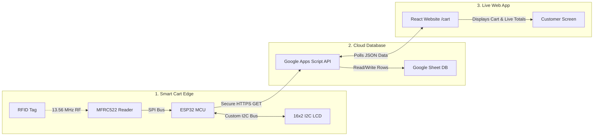
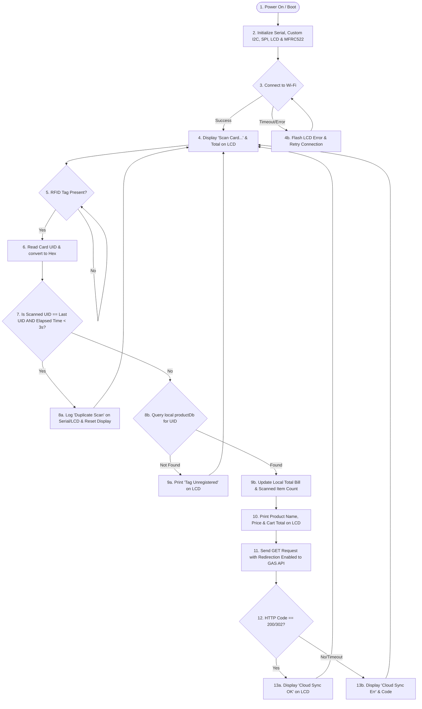

# IoT-Based Smart RFID Shopping Cart System
## Technical Architecture, Wiring, and Deployment Manual

This document provides a comprehensive technical overview of the **"IoT-Based Smart RFID Shopping Cart Using ESP32 and Website Integration"** project. It includes diagrams, flowcharts, hardware connections, API configurations, and debugging tutorials.

---

## 1. System Architecture

The project consists of three main tiers: **Hardware Edge**, **Cloud Database & API**, and the **Web Client Frontend**.



### Data Flow Overview:
1. **Scan Event**: An RFID tag passes near the MFRC522 reader.
2. **Identification & Match**: The ESP32 reads the card's UID, checks its local database for price/name, updates local cart totals, and flashes details on the I2C LCD.
3. **Cloud Push**: The ESP32 triggers a secure HTTPS GET query to the Google Apps Script Web App.
4. **App Script Handling**: The Script appends a transaction row to Google Sheets and returns a JSON receipt.
5. **Real-time Web Sync**: The React website polls the Google Apps Script API at short intervals, groups raw scan rows by UID, updates quantities, and calculates grand totals dynamically without page reloads.

---

## 2. IoT Communication Flowchart

This flowchart outlines the main execution loop running inside the ESP32 firmware:



---

## 3. Hardware Connections & Pin Out

To avoid conflict with the MFRC522's Reset (`RST`) pin assigned to **GPIO 22**, the I2C LCD SCL is custom-routed to **GPIO 4**. 

### 3.1. ESP32 to MFRC522 Wiring

| MFRC522 Pin | ESP32 Pin | Wire Function | Notes |
| :--- | :--- | :--- | :--- |
| **SDA (SS)** | **GPIO 5** | SPI Chip Select | Crucial for SPI communication |
| **SCK** | **GPIO 18** | SPI Clock | Serial Clock line |
| **MOSI** | **GPIO 23** | SPI Master Out Slave In | Data line out of ESP32 |
| **MISO** | **GPIO 19** | SPI Master In Slave Out | Data line into ESP32 |
| **RST** | **GPIO 22** | SPI Reset | Power down and reset control |
| **GND** | **GND** | Ground | Common system ground |
| **3.3V** | **3.3V** | 3.3V VCC | **WARNING**: Do NOT connect to 5V! Can destroy MFRC522 |

### 3.2. ESP32 to I2C 16x2 LCD Wiring

| LCD I2C Pin | ESP32 Pin | Wire Function | Notes |
| :--- | :--- | :--- | :--- |
| **SDA** | **GPIO 21** | I2C Data Line | Standard I2C SDA pin |
| **SCL** | **GPIO 4** | I2C Clock Line | Custom SCL (Bypasses SCL-GPIO22 conflict) |
| **VCC** | **VIN (5V)** | LCD Backlight Power | Requires 5V; 3.3V will result in a dim display |
| **GND** | **GND** | Ground | Common system ground |

---

## 4. Google Sheets & Apps Script Setup

Follow these exact steps to deploy the cloud database backend:

1. **Create Google Sheet**:
   * Open your web browser and navigate to [Google Sheets](https://sheets.google.com).
   * Create a new spreadsheet and title it `Smart_Cart_Database`.
   * Add headers in Row 1: **A1**: `Timestamp`, **B1**: `UID`, **C1**: `Product Name`, **D1**: `Price`.
   
2. **Open Apps Script Editor**:
   * In the top menu bar, go to **Extensions** -> **Apps Script**.
   * Rename the script project to `SmartCart_API`.

3. **Paste Backend Code**:
   * Paste the script from [code.gs](file:///d:/PROGRAMMING/ekart-bill-flow/apps-script/code.gs) into the editor (replace default code).
   * Save the script by clicking the Save icon (floppy disk) or pressing `Ctrl + S`.
   * Run the `setupSheet` function once (click **Run** at the top with `setupSheet` selected) to initialize spreadsheet columns.

4. **Deploy as Web App**:
   * Click the blue **Deploy** button in the top right -> Choose **New deployment**.
   * Click the gear icon next to "Select type" and choose **Web app**.
   * Configure the deployment details:
     * *Description*: `Smart Cart Real-Time API V1`
     * *Execute as*: **Me (your-email@gmail.com)**
     * *Who has access*: **Anyone** (This is crucial, otherwise ESP32 and website will receive 401/403 authorization errors).
   * Click **Deploy**.
   * Grant necessary permissions if prompted (Click *Review Permissions*, log in to your Google Account, click *Advanced*, and choose *Go to SmartCart_API (unsafe)*, then click *Allow*).

5. **Record Web App URL**:
   * Copy the generated **Web app URL**. It will look like this:
     `https://script.google.com/macros/s/AKfycbz_XXXXXXXXXXXXXX_YYYYYYYYYYYYYY/exec`
   * Save this URL! You will paste it in the ESP32 code and inside the website settings panel.

---

## 5. Deployment & Settings in React Frontend

The React frontend has a native configuration dashboard designed to link your deployed Apps Script API instantly:

1. Start your local Vite dev server (run `npm run dev` or equivalent).
2. Open the browser and go to the cart page: `http://localhost:5173/cart`.
3. In the top right corner, click **API Settings** to expand the integration panel.
4. Paste your **Google Apps Script Web App URL** and click **Save & Test**.
5. Once saved, the status badge will switch to **Live Connected** and begin polling from Google Sheets every 3 seconds.
6. The URL is cached in the browser's `localStorage` so it remains configured even if you refresh or close the browser tab.

---

## 6. Testing & Troubleshooting Methodology

### 6.1. Simulation (Hardware-Free Testing)
You can test the whole cloud database pipeline before assembling the ESP32:
* **Simulating a Scan**: Paste your Web App URL into your web browser or send a GET request via `curl` or Postman:
  ```bash
  curl -L "https://script.google.com/macros/s/YOUR_DEPLOYMENT_ID/exec?action=add&uid=A1B2C3&product=Milk&price=55"
  ```
  *(Note the `-L` flag is required to instruct curl to follow redirects)*
* Check your Google Sheet; you should see "Milk" added to the bottom row with the timestamp.
* The React website table will update within 3 seconds to display the milk cart row, updating the Grand Total and history feed automatically.

### 6.2. Common Troubleshooting Steps

* **ESP32 LCD remains blank / dim**: Verify that LCD VCC is wired to ESP32 **VIN (5V)** instead of 3.3V. Adjust the blue potentiometer on the back of the LCD backpack with a screwdriver to fix contrast.
* **MFRC522 Init Error on Serial Monitor**: Check SPI wiring. Make sure SDA connects to GPIO 5 and RST connects to GPIO 22.
* **Cloud Sync Err (Code -1)**: Indicates that the ESP32 could not connect to Wi-Fi or cannot reach Google DNS. Check Wi-Fi SSID and password. Bypassing certificate checks using `client.setInsecure()` handles DNS SSL handshakes properly.
* **CORS Blocked error on Website Console**: Make sure you have deployed your Apps Script with Who has access set to **Anyone**. Re-deploying is necessary if you change permissions (always select **New Deployment** -> type Web App to update the public endpoint).
* **Reset/Clear button doesn't work**: Ensure the sheet name in the Google Apps Script script is the active one (`sheet = SpreadsheetApp.getActiveSpreadsheet().getActiveSheet()`), and the sheet matches your template setup.
